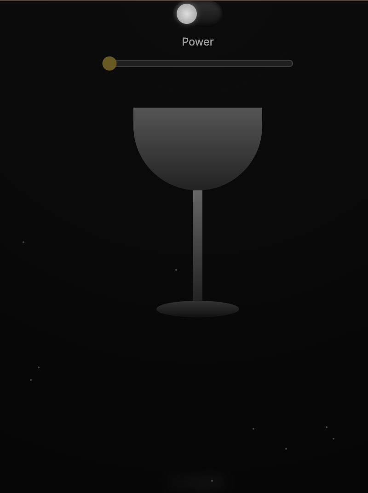
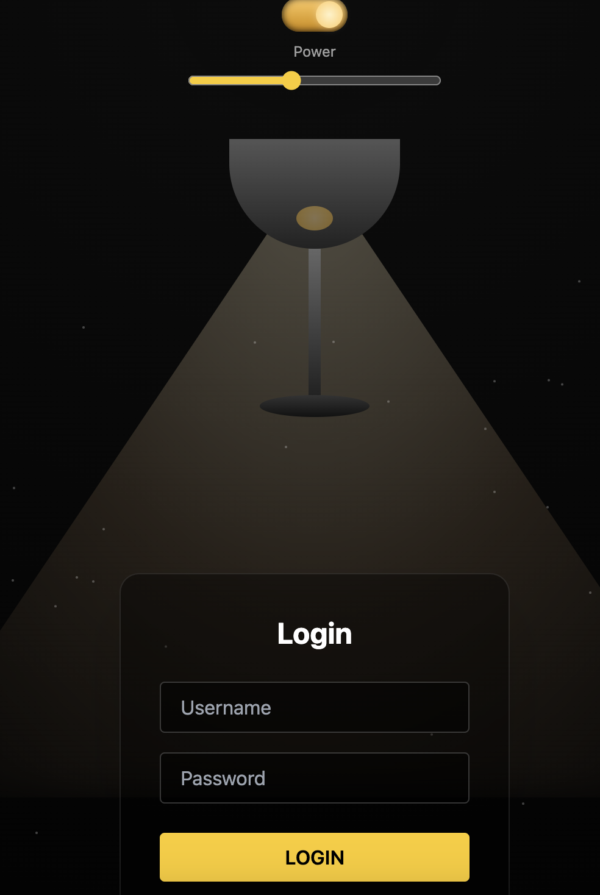
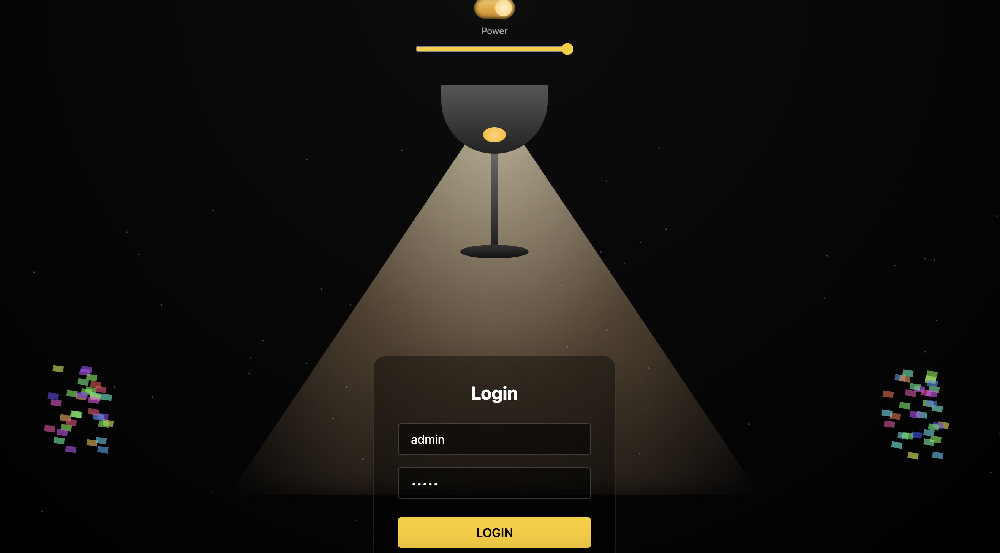

  <a href="https://instagram.com/arjalikastudio" target="_blank">📸 Instagram</a> •
  <a href="https://www.tiktok.com/@arjalikastudio" target="_blank">🎵 TikTok</a> •
  <a href="https://www.youtube.com/@ArjalikaStudio" target="_blank">▶️ Youtube</a> •
  <a href="https://arjalikastudio.com" target="_blank">🌐 Website</a>

# 💡 Lamp Login Cinematic UI

A cinematic login UI inspired by a **realistic bedside lamp** concept.  
The interface remains almost invisible in darkness and slowly reveals itself as the lamp is turned on using a physical switch and brightness slider.

Designed for:
- TikTok / Reels content
- Creative landing pages
- UI/UX experiments
- Portfolio showcases

---

## ✨ Features

- 🔘 **Power Switch (ON / OFF)**  
  Fully turns the lamp on or off like a real bedside lamp

- 🎚️ **Brightness Slider**  
  Smooth light intensity control

- 💡 **Cinematic Light Cone**  
  Realistic cone-shaped lighting with blur and gradients

- 🌫️ **Floating Dust Particles**  
  Dust becomes visible only when the lamp is on

- 👻 **Horror Effect (Login Failed)**  
  Screen shake + sudden light dimming

- 🎉 **Success Effect (Login Success)**  
  Confetti burst from bottom-left and bottom-right corners

- 🔐 **Demo Credentials**
username: admin
password: admin

---

## 🧱 Tech Stack

- HTML5
- TailwindCSS (CDN)
- Vanilla JavaScript
- Pure CSS Animations

❌ No framework  
❌ No external JS libraries  

---

## 🚀 How to Run

1. Download or clone the project
2. Open `index.html`
3. Run directly in your browser (Chrome recommended)

No server required.

---

## 🧠 How It Works

1. Toggle the **Power Switch** to turn on the lamp
2. Adjust the **brightness slider**
3. Enter username and password
4. Click **LOGIN**
 - Wrong credentials → horror effect
 - Correct credentials → success celebration 🎉

---

## 🎬 Content Ready

Perfect for:
- TikTok Reels
- Instagram Reels
- YouTube Shorts
- UI motion showcases

Recommended:
- Aspect ratio: 9:16
- Medium brightness for recording

---

## 📁 File Structure
- index.html
- style.css
- script.js
- README.md

---

## ⚠️ Disclaimer

- This project is a **UI demo only**
- Not intended for real authentication systems
- Free to modify for creative and educational purposes

---

## 📸 Screenshots

<table>
  <tr>
    <td align="center">
      
    </td>
    <td align="center">
      
    </td>
  </tr>
  <tr>
    <td colspan="2" align="center">
      
    </td>
  </tr>
</table>

---

## ☕ Support the Creator

If you find this project useful or inspiring,  
consider supporting the creator via Trakteer 🙌
<a href="https://trakteer.id/arjalikastudio/tip" target="_blank">Open Trakteer</a>

Thank you for supporting independent creators 🚀
